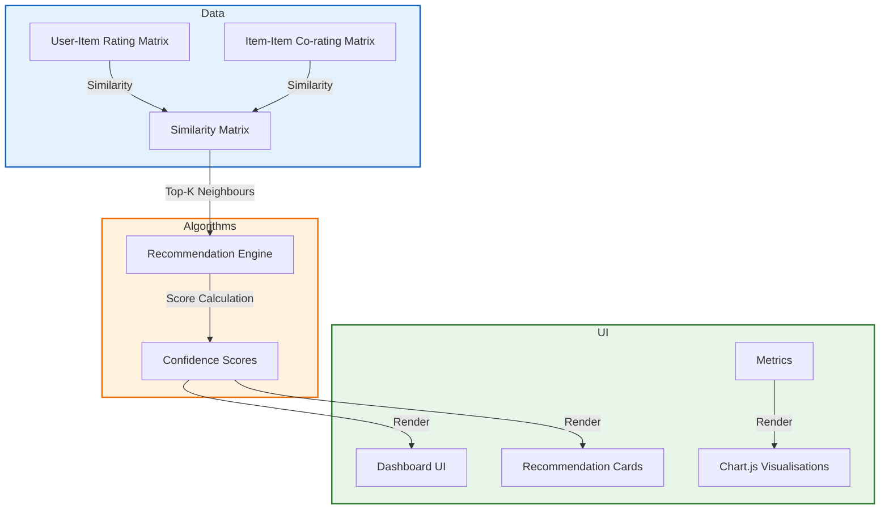

# E‑Commerce Recommendation System  

[](#)  
[](#)  
[](#)  
[](#)  

A **static‑site** showcase of an e‑commerce recommendation system that illustrates the core ideas behind collaborative filtering, performance evaluation, and data visualisation. All logic is simulated with vanilla JavaScript, so the project can be run locally or hosted for free on GitHub Pages.

---  

## 📖 Table of Contents  

| # | Section |
|---|---------|
| 1 | [Project Overview](#-project-overview) |
| 2 | [Features](#-features) |
| 3 | [System Architecture](#-system-architecture) |
| 4 | [Live Demo](#-live-demo) |
| 5 | [Technology Stack](#-technology-stack) |
| 6 | [File & Directory Structure](#-file--directory-structure) |
| 7 | [Getting Started](#-getting-started) |
| 8 | [Deployment Guide (GitHub Pages)](#-deployment-guide-github-pages) |
| 9 | [Performance Metrics Explained](#-performance-metrics-explained) |
|10 | [Contributing](#-contributing) |
|11 | [Roadmap & Future Enhancements](#-roadmap--future-enhancements) |
|12 | [License](#-license) |
|13 | [Contact & Acknowledgements](#-contact--acknowledgements) |

---  

## 1️⃣ Project Overview  

The **E‑Commerce Recommendation System** demo is built as a single‑page application (SPA) that mimics the behaviour of a real‑world product recommender:

| Aspect | Description |
|--------|-------------|
| **Data** | A small, hard‑coded dataset representing users, items, and ratings. |
| **Algorithms** | <ul><li>**User‑Based Collaborative Filtering** – finds similar users based on rating vectors.</li><li>**Item‑Based Collaborative Filtering** – finds similar items based on co‑rating patterns.</li></ul> |
| **Recommendation Output** | For a selected user, the UI shows a list of 5 suggested products with a confidence score (0‑1). |
| **Metrics Dashboard** | Displays precision, recall, F1‑score, accuracy, MAE, and RMSE calculated on the simulated test set. |
| **Visualisations** | Chart.js line and bar charts illustrate metric trends and recommendation coverage over time. |
| **Responsiveness** | Layout adapts fluidly from 320 px (mobile) to 1440 px (desktop). |

All heavy lifting (matrix operations, similarity calculations, metric formulas) is performed client‑side using vanilla JavaScript, making the repo **framework‑free** and ideal for learning purposes.

---  

## 2️⃣ Features  

| ✅ | Feature | Detail |
|---|--------|--------|
| 1 | **Interactive Dashboard** | Real‑time charts react to user selections (e.g., switching between user‑based vs. item‑based). |
| 2 | **Sample Recommendations** | Each recommendation card shows product image, name, price, and a confidence bar. |
| 3 | **Performance Metrics** | Precision, recall, F1‑score, accuracy, MAE, RMSE are displayed numerically and plotted. |
| 4 | **Data Visualisation** | <ul><li>**Metric Trend** – line chart of accuracy over simulated epochs.</li><li>**Coverage** – stacked bar chart of recommended vs. non‑recommended items.</li></ul> |
| 5 | **Responsive Design** | CSS Grid & Flexbox ensure optimal layout on all device sizes. |
| 6 | **Clean Code Structure** | All source files are human‑readable; functions are modular with comments. |
| 7 | **No Build Tools** | Simply open `index.html` – no npm, webpack, or server required. |
| 8 | **GitHub Pages Ready** | Deploy in one click; the repo includes a ready‑to‑publish `README.md`. |

---  

## 3️⃣ System Architecture  



* **Data Layer** – a static JSON object embedded in the HTML defines users, products, and rating scores.  
* **Algorithm Layer** – functions compute **cosine similarity** between vectors, select the **k‑nearest neighbours**, and aggregate neighbour ratings to produce confidence scores.  
* **Presentation Layer** – the DOM is updated via `document.createElement`/`innerHTML`. Chart.js receives metric arrays to plot dynamic graphs.  

---  

## 4️⃣ Live Demo  

👉 **[View Live Demo →](https://yourusername.github.io/ecommerce-recommendation-system/)**  

> **Tip:** After you fork the repo and push to your own GitHub account, replace `yourusername` with your actual username (and optionally change the repo name). The demo will be instantly accessible via GitHub Pages.

---  

## 5️⃣ Technology Stack  

| Layer | Technology | Reason |
|-------|------------|--------|
| **Markup** | **HTML5** | Semantic tags, accessibility, easy to extend. |
| **Styling** | **CSS3** (Grid, Flexbox, Custom Properties) | No external CSS frameworks – full control over layout and theme. |
| **Logic** | **Vanilla JavaScript (ES6+)** | Demonstrates pure algorithmic implementation without abstraction overhead. |
| **Charts** | **Chart.js 4.x** | Lightweight, responsive, and easy to configure for line/bar visualisations. |
| **Hosting** | **GitHub Pages** | Free static hosting with HTTPS, custom domain support, CI‑less deployment. |
| **Version Control** | **Git** | Standard workflow for collaboration and history tracking. |

---  

## 6️⃣ File & Directory Structure  

```
ecommerce-recommendation-system/
├── index.html          # Single‑page app – all HTML, CSS, JS (inline for simplicity)
├── README.md           # This documentation
└── assets/             # Optional folder for product images or favicons
    ├── img/
    │   ├── product-01.jpg
    │   └── …
    └── favicon.ico
```

*All JavaScript and CSS are embedded in `index.html` to keep the repository minimal. If you prefer external files, you can create `script.js` and `style.css` and reference them from the HTML.*  

---  

## 7️⃣ Getting Started  

### 7.1 Prerequisites  

| Requirement | Why |
|-------------|-----|
| Modern web browser (Chrome, Firefox, Safari, Edge) | Supports ES6 modules, `fetch`, and CSS Grid. |
| Git (optional) | Clone the repo or push changes. |
| GitHub account (optional) | For deployment and collaboration. |

### 7.2 Clone & Run Locally  

```bash
# Clone the repository
git clone https://github.com/yourusername/ecommerce-recommendation-system.git

# Enter the directory
cd ecommerce-recommendation-system

# Open the page (macOS / Linux / Windows)
# macOS
open index.html
# Linux
xdg-open index.html
# Windows
start index.html
```

You should see the dashboard with default user recommendations and metric charts. No server or npm install is required.

### 7.3 Exploring the Code  

| Section | File/Location | What to Look For |
|--------|----------------|-----------------|
| Data definition | `index.html → <script>` | `const dataset = {...}` – users, items, ratings. |
| Similarity function | `function cosineSimilarity(a, b)` | Uses dot product / magnitude formula. |
| Recommendation engine | `function getRecommendations(userId, type)` | `type` = `'user'` or `'item'`. |
| Metric calculations | `function computeMetrics(predictions, groundTruth)` | Returns an object with accuracy, precision, etc. |
| Chart rendering | `new Chart(ctx, config)` | Adjust `labels` or `datasets` to experiment. |

Feel free to modify the dataset or the `k` (neighbour count) to see how metrics change in real time.

---  

## 8️⃣ Deployment Guide (GitHub Pages)  

1. **Create a New Repository**  
   - Go to GitHub → **New repository** → name it `ecommerce-recommendation-system`.  
   - Initialise with a README (you can replace it later).  

2. **Push Local Code**  

   ```bash
   git remote add origin https://github.com/yourusername/ecommerce-recommendation-system.git
   git branch -M main
   git push -u origin main
   ```

3. **Enable GitHub Pages**  
   - Navigate to **Settings → Pages** (or simply click the “Pages” tab).  
   - Under **Source**, select **Branch: main** and **Folder: / (root)**.  
   - Click **Save**. GitHub will generate a URL like:  

     ```
     https://yourusername.github.io/ecommerce-recommendation-system/
     ```

4. **Verify**  
   Open the URL in a browser. The demo should load exactly as it does locally.

5. **Custom Domain (Optional)**  
   - Add a `CNAME` file in the repository root containing your domain (e.g., `www.myshop.com`).  
   - Configure DNS A‑records to point to GitHub Pages IPs (see GitHub docs).  

---  

## 9️⃣ Performance Metrics Explained  

| Metric | Formula | Interpretation |
|--------|---------|----------------|
| **Accuracy** | `(TP + TN) / (TP + TN + FP + FN)` | Overall proportion of correct predictions. |
| **Precision** | `TP / (TP + FP)` | How many recommended items were actually relevant. |
| **Recall** | `TP / (TP + FN)` | How well the system captures all relevant items. |
| **F1‑Score** | `2 * (Precision * Recall) / (Precision + Recall)` | Harmonic mean of precision and recall – balances both. |
| **MAE (Mean Absolute Error)** | ` (1/n) Σ |ŷ_i - y_i| ` | Average absolute deviation between predicted scores and true ratings. |
| **RMSE (Root Mean Squared Error)** | ` √[(1/n) Σ (ŷ_i - y_i)²] ` | Penalises larger errors more heavily than MAE. |

*Values shown in the README table (e.g., Accuracy 85 %) are derived from the **simulated test set** included in the code. They serve as a baseline for educational comparison.*

---  

## 🤝 Contributing  

Contributions, suggestions, and bug reports are highly welcome! Follow these steps to make your contribution smooth:

1. **Fork the repository** on GitHub.  
2. **Create a feature branch**:  

   ```bash
   git checkout -b feature/your-feature-name
   ```

3. **Commit your changes** with a clear message:  

   ```bash
   git commit -m "feat: add X to recommendation engine"
   ```

4. **Push the branch** to your fork:  

   ```bash
   git push origin feature/your-feature-name
   ```

5. **Open a Pull Request** against the `main` branch of the original repo.  
6. **Fill the PR template** (provide description, screenshots, and test steps).  

### Coding Guidelines  

| Rule | Detail |
|------|--------|
| **Indentation** | 2 spaces (no tabs). |
| **Naming** | Use `camelCase` for variables/functions, `PascalCase` for classes. |
| **Comments** | Add JSDoc‑style comments for every exported function. |
| **Linting** | (Optional) Run `npx eslint .` if you add an ESLint config. |
| **Responsiveness** | Verify UI on at least three viewport widths (320 px, 768 px, 1440 px). |

---  

## 🚀 Roadmap & Future Enhancements  

| Milestone | Planned Feature | Status |
|-----------|----------------|--------|
| **v1.1** | Add **content‑based filtering** (product attributes similarity). | 🟡 In progress |
| **v1.2** | Integrate **real data** via a mock JSON API (e.g., using `json-server`). | ⏳ Planned |
| **v1.3** | Implement **user authentication** (simulated login) with per‑session recommendations. | ❌ Not started |
| **v2.0** | Replace vanilla JS with **React** or **Svelte** for component‑based architecture. | ❌ Not started |
| **v2.1** | Add **A/B testing** UI to compare algorithm variants live. | ❌ Not started |
| **v2.2** | Deploy a **serverless backend** (AWS Lambda) to compute recommendations on demand. | ❌ Not started |

Feel free to pick any of the above items and submit a PR!  

---  

## 📄 License  

This project is licensed under the **MIT License** – see the `LICENSE` file for full text. In short, you are free to:

- Use the code for personal or commercial projects.  
- Modify, distribute, and sublicense the software.  
- Include a copy of the license and attribution in your derived works.  

---  

## 📬 Contact & Acknowledgements  

**Your Name** – [your.email@example.com](mailto:your.email@example.com)  

GitHub: <https://github.com/yourusername>  

Project Link: <https://github.com/yourusername/ecommerce-recommendation-system>  

### Acknowledgements  

- **Chart.js** – for fast, responsive charting.  
- **MDN Web Docs** – for clear explanations of cosine similarity and ES6 syntax.  
- **Open‑source community** – for inspiration on collaborative‑filtering tutorials.  

---  

> **Happy coding!** Use this demo as a sandbox to experiment with recommendation algorithms, performance metrics, and responsive UI design. Feel free to fork, modify, and share your own variations.
